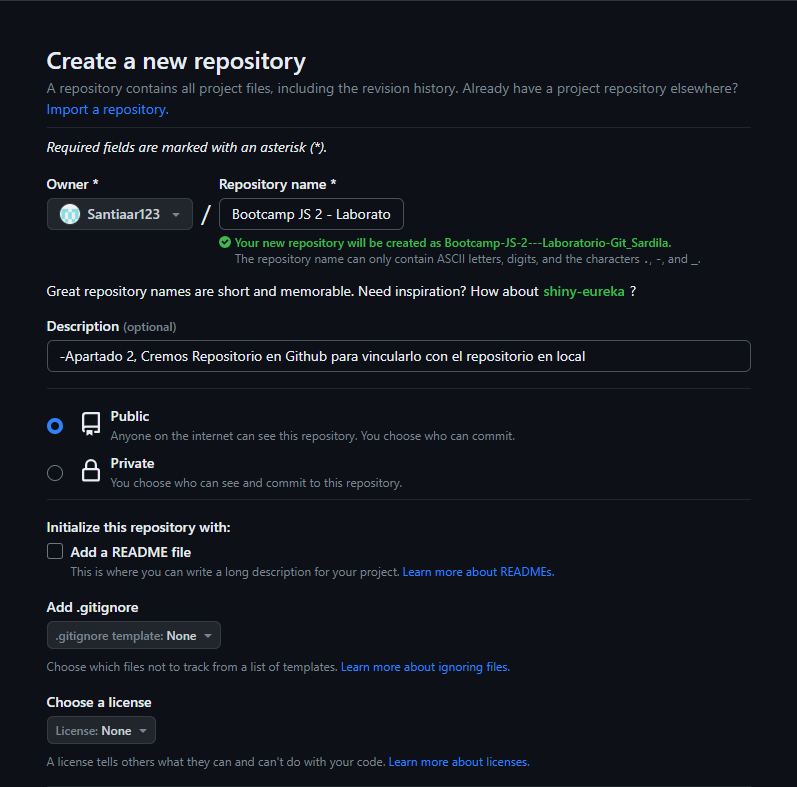
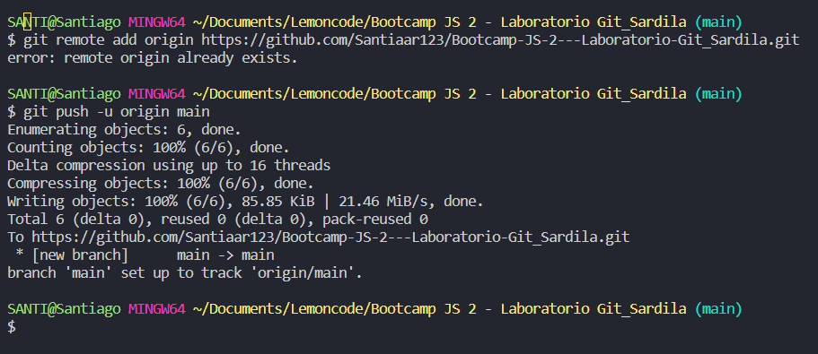
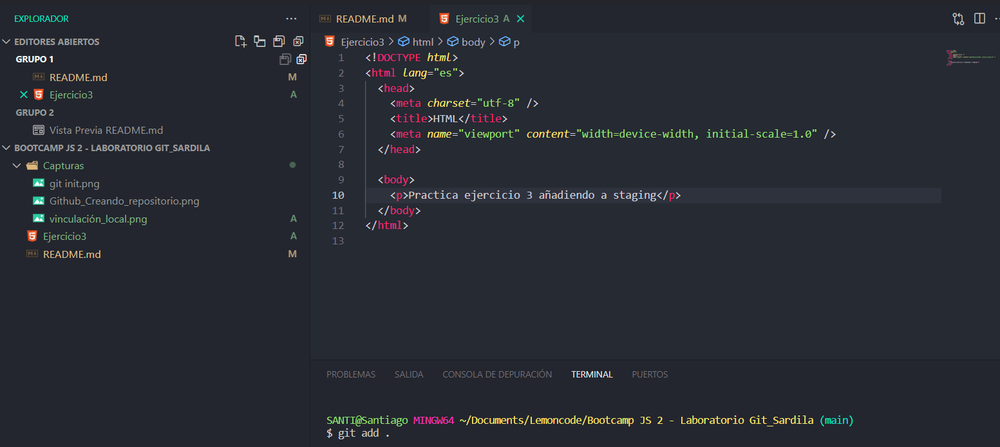

# Entrega Laboratorio de Git Santiago Ardila

1. Crear un repositorio en local

> Creamos una carpeta ingresamos a ella e inicializamos el repositorio de GIT

2. Subir el repositorio a GitHub

> Cremos Repositorio en Github para vincularlo con el repositorio en local

> Comprobamos que se ha vinculado correctamente en Github **_"el error de la captura es por que ya había ejecutado el comando anteriormente"_**

3. Hacer un commit y un push

> Creamos un archivo HTML y lo añadimos a staging utilizando el comando **_git add _** , también se puede realizar con el comando **_git add Nonbre_Archivo_**

> Hacemos un Commit con los cambios guardados con un mensaje y realizamos el comando **_git push_** para subir los cambios al repositorio de github.

4. Crear una rama

> Creamos una ramacon el comando **_git branch_** llamada "Development" y nos dirigimos a ella con el comando \*\*\_git checkout Development

>
